# Diagramas de flujo — Procurex de punta a punta

Todos los flujos de la plataforma, sacados del código actual (frontend `bolt_pro` y backend `bolt_procure_backend`). Los diagramas están en Mermaid: GitHub los muestra como gráficos y también se pueden abrir en [mermaid.live](https://mermaid.live).

**Índice**

0. [Mapa general](#0-mapa-general)
1. [Autenticación y acceso](#1-autenticación-y-acceso)
2. [Alta de una empresa cliente y onboarding](#2-alta-de-una-empresa-cliente-y-onboarding)
3. [Registro y onboarding del proveedor](#3-registro-y-onboarding-del-proveedor)
4. [Homologación](#4-homologación)
5. [Creación del requerimiento](#5-creación-del-requerimiento)
6. [Aprobaciones y matriz](#6-aprobaciones-y-matriz)
7. [Licitación: invitaciones, red, preguntas y ofertas](#7-licitación-invitaciones-red-preguntas-y-ofertas)
8. [Evaluación y decisión](#8-evaluación-y-decisión)
9. [Negociación: subasta inversa en vivo](#9-negociación-subasta-inversa-en-vivo)
10. [Adjudicación y firma](#10-adjudicación-y-firma)
11. [Contratos, contrato marco y modificaciones](#11-contratos-contrato-marco-y-modificaciones)
12. [Ejecución: hitos y entregas](#12-ejecución-hitos-y-entregas)
13. [Facturación, pagos y pronto pago](#13-facturación-pagos-y-pronto-pago)
14. [Evaluación de desempeño](#14-evaluación-de-desempeño)
15. [Cierre del proceso: ciclo de vida del requerimiento](#15-cierre-del-proceso-ciclo-de-vida-del-requerimiento)
16. [Plantillas y documentos](#16-plantillas-y-documentos)
17. [Integración ERP y Siigo](#17-integración-erp-y-siigo)
18. [Riesgo continuo](#18-riesgo-continuo)
19. [Red de proveedores y vitrina](#19-red-de-proveedores-y-vitrina)
20. [Analítica](#20-analítica)
21. [Panel interno](#21-panel-interno)
22. [Procesos automáticos y notificaciones](#22-procesos-automáticos-y-notificaciones)
23. [Resumen de estados](#23-resumen-de-estados)

---

## 0. Mapa general

Quién hace qué y cómo se conectan los tres portales. Todo pasa por la misma API y la misma base de datos.

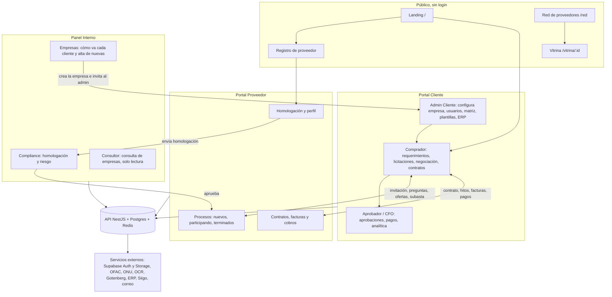
```mermaid
flowchart TD
    subgraph PUB["Público, sin login"]
        L["Landing /"]
        RED["Red de proveedores /red"]
        VIT["Vitrina /vitrina/:id"]
        REG["Registro de proveedor"]
    end
    subgraph CLI["Portal Cliente"]
        C1["Admin Cliente: configura empresa, usuarios, matriz, plantillas, ERP"]
        C2["Comprador: requerimientos, licitaciones, negociación, contratos"]
        C3["Aprobador / CFO: aprobaciones, pagos, analítica"]
    end
    subgraph PRO["Portal Proveedor"]
        P1["Homologación y perfil"]
        P2["Procesos: nuevos, participando, terminados"]
        P3["Contratos, facturas y cobros"]
    end
    subgraph INT["Panel Interno"]
        I1["Compliance: homologación y riesgo"]
        I2["Consultor: consulta de empresas, solo lectura"]
        I3["Empresas: cómo va cada cliente y alta de nuevas"]
    end
    API[("API NestJS + Postgres + Redis")]
    EXT["Servicios externos: Supabase Auth y Storage, OFAC, ONU, OCR, Gotenberg, ERP, Siigo, correo"]

    L --> REG --> P1
    L --> C2
    RED --> VIT
    I3 -->|"crea la empresa e invita al admin"| C1
    C1 --> C2 --> C3
    P1 -->|"envía homologación"| I1
    I1 -->|"aprueba"| P2
    C2 <-->|"invitación, preguntas, ofertas, subasta"| P2
    C2 <-->|"contrato, hitos, facturas, pagos"| P3
    CLI & PRO & INT --> API --> EXT
```

**Ciclo completo de una compra**, de la configuración al cierre:

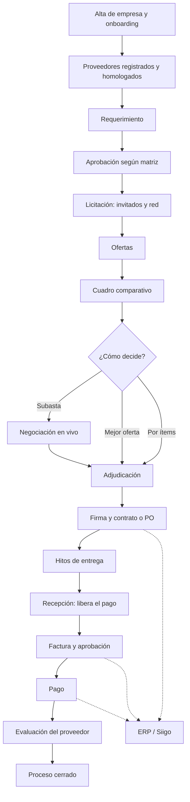
```mermaid
flowchart TD
    A["Alta de empresa y onboarding"] --> B["Proveedores registrados y homologados"]
    B --> C["Requerimiento"] --> D["Aprobación según matriz"]
    D --> E["Licitación: invitados y red"] --> F["Ofertas"]
    F --> G["Cuadro comparativo"]
    G --> H{"¿Cómo decide?"}
    H -->|"Subasta"| I["Negociación en vivo"] --> J
    H -->|"Mejor oferta"| J["Adjudicación"]
    H -->|"Por ítems"| J
    J --> K["Firma y contrato o PO"] --> L["Hitos de entrega"]
    L --> M["Recepción: libera el pago"] --> N["Factura y aprobación"] --> O["Pago"]
    O --> P["Evaluación del proveedor"] --> Q["Proceso cerrado"]
    K -.-> ERP["ERP / Siigo"]
    N -.-> ERP
    O -.-> ERP
```

---

## 1. Autenticación y acceso

Sirve para los tres portales. La autenticación la hace Supabase Auth y la autorización la API, según el portal y el rol.

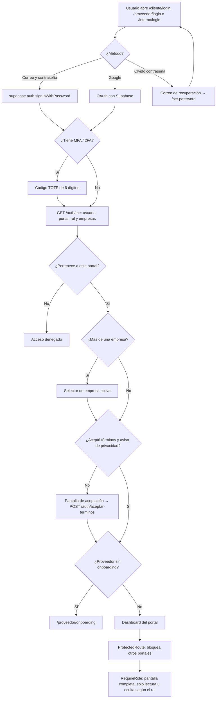
```mermaid
flowchart TD
    A["Usuario abre /cliente/login, /proveedor/login o /interno/login"] --> B{"¿Método?"}
    B -->|"Correo y contraseña"| C["supabase.auth.signInWithPassword"]
    B -->|"Google"| D["OAuth con Supabase"]
    B -->|"Olvidó contraseña"| R["Correo de recuperación → /set-password"] --> A
    C & D --> E{"¿Tiene MFA / 2FA?"}
    E -->|"Sí"| F["Código TOTP de 6 dígitos"] --> G
    E -->|"No"| G["GET /auth/me: usuario, portal, rol y empresas"]
    G --> H{"¿Pertenece a este portal?"}
    H -->|"No"| X["Acceso denegado"]
    H -->|"Sí"| I{"¿Más de una empresa?"}
    I -->|"Sí"| J["Selector de empresa activa"] --> K
    I -->|"No"| K{"¿Aceptó términos y aviso de privacidad?"}
    K -->|"No"| T["Pantalla de aceptación → POST /auth/aceptar-terminos"] --> M
    K -->|"Sí"| M{"¿Proveedor sin onboarding?"}
    M -->|"Sí"| N["/proveedor/onboarding"]
    M -->|"No"| O["Dashboard del portal"]
    O --> P["ProtectedRoute: bloquea otros portales"]
    P --> Q["RequireRole: pantalla completa, solo lectura u oculta según el rol"]
```

**Roles y lo que ven**

| Portal | Rol | Alcance principal |
|---|---|---|
| Cliente | Admin Cliente | Todo, incluidos usuarios, matriz, plantillas, ERP y estructura |
| Cliente | Comprador | Requerimientos, licitaciones, negociación, contratos, seguimiento |
| Cliente | Aprobador / CFO | Aprobaciones, adjudicación, pagos, analítica; licitaciones en solo lectura |
| Proveedor | Proveedor | Su homologación, oportunidades, ofertas, contratos y cobros |
| Interno | Consultor | Empresas, solo lectura |
| Interno | Compliance / Ops | Empresas y alta de nuevas, cola de homologación, riesgo continuo |

---

## 2. Alta de una empresa cliente y onboarding

Las empresas compradoras no se registran solas: el equipo de Procurex las crea (onboarding asistido) y el administrador invita a su equipo.

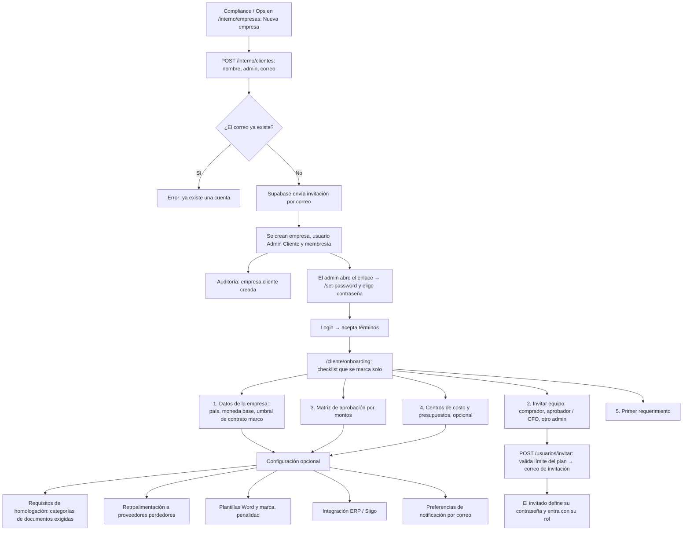
```mermaid
flowchart TD
    A["Compliance / Ops en /interno/empresas: Nueva empresa"] --> B["POST /interno/clientes: nombre, admin, correo"]
    B --> C{"¿El correo ya existe?"}
    C -->|"Sí"| C1["Error: ya existe una cuenta"]
    C -->|"No"| D["Supabase envía invitación por correo"]
    D --> E["Se crean empresa, usuario Admin Cliente y membresía"]
    E --> E1["Auditoría: empresa cliente creada"]
    E --> F["El admin abre el enlace → /set-password y elige contraseña"]
    F --> G["Login → acepta términos"]
    G --> H["/cliente/onboarding: checklist que se marca solo"]
    H --> H1["1. Datos de la empresa: país, moneda base, umbral de contrato marco"]
    H --> H2["2. Invitar equipo: comprador, aprobador / CFO, otro admin"]
    H --> H3["3. Matriz de aprobación por montos"]
    H --> H4["4. Centros de costo y presupuestos, opcional"]
    H --> H5["5. Primer requerimiento"]
    H2 --> I["POST /usuarios/invitar: valida límite del plan → correo de invitación"]
    I --> J["El invitado define su contraseña y entra con su rol"]
    H1 & H3 & H4 --> K["Configuración opcional"]
    K --> K1["Requisitos de homologación: categorías de documentos exigidas"]
    K --> K2["Retroalimentación a proveedores perdedores"]
    K --> K3["Plantillas Word y marca, penalidad"]
    K --> K4["Integración ERP / Siigo"]
    K --> K5["Preferencias de notificación por correo"]
```

**Gestión de usuarios después del alta**

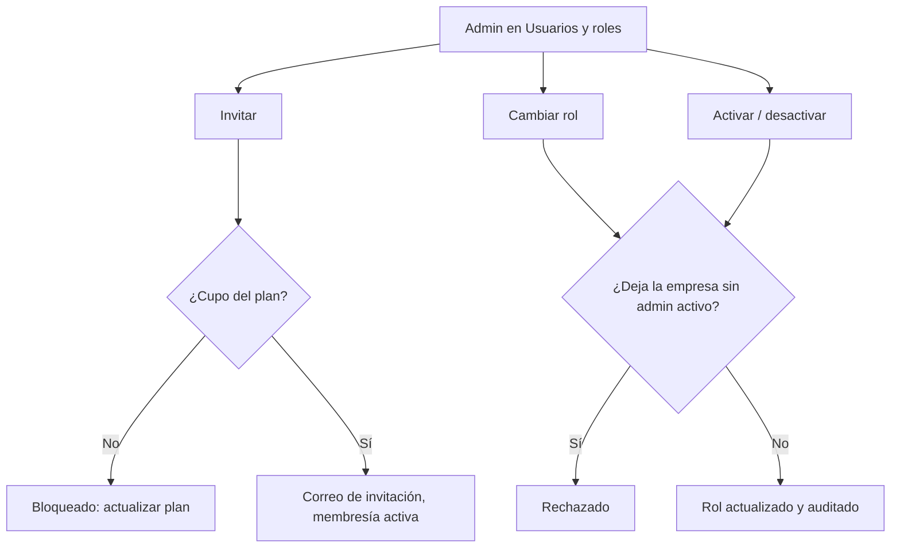
```mermaid
flowchart TD
    A["Admin en Usuarios y roles"] --> B["Invitar"] --> B1{"¿Cupo del plan?"}
    B1 -->|"No"| B2["Bloqueado: actualizar plan"]
    B1 -->|"Sí"| B3["Correo de invitación, membresía activa"]
    A --> C["Cambiar rol"] --> C1{"¿Deja la empresa sin admin activo?"}
    C1 -->|"Sí"| C2["Rechazado"]
    C1 -->|"No"| C3["Rol actualizado y auditado"]
    A --> D["Activar / desactivar"] --> C1
```

---

## 3. Registro y onboarding del proveedor

El registro es autoservicio y gratis: "homológate una vez y participa en los procesos de todas las empresas de Procurex".

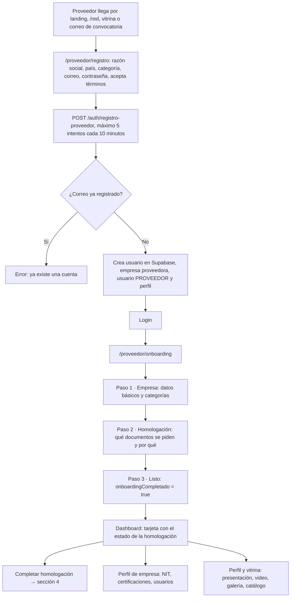
```mermaid
flowchart TD
    A["Proveedor llega por landing, /red, vitrina o correo de convocatoria"] --> B["/proveedor/registro: razón social, país, categoría, correo, contraseña, acepta términos"]
    B --> C["POST /auth/registro-proveedor, máximo 5 intentos cada 10 minutos"]
    C --> D{"¿Correo ya registrado?"}
    D -->|"Sí"| D1["Error: ya existe una cuenta"]
    D -->|"No"| E["Crea usuario en Supabase, empresa proveedora, usuario PROVEEDOR y perfil"]
    E --> F["Login"]
    F --> G["/proveedor/onboarding"]
    G --> G1["Paso 1 · Empresa: datos básicos y categorías"]
    G1 --> G2["Paso 2 · Homologación: qué documentos se piden y por qué"]
    G2 --> G3["Paso 3 · Listo: onboardingCompletado = true"]
    G3 --> H["Dashboard: tarjeta con el estado de la homologación"]
    H --> I["Completar homologación → sección 4"]
    H --> J["Perfil de empresa: NIT, certificaciones, usuarios"]
    H --> K["Perfil y vitrina: presentación, video, galería, catálogo"]
```

---

## 4. Homologación

### 4.1 Del lado del proveedor

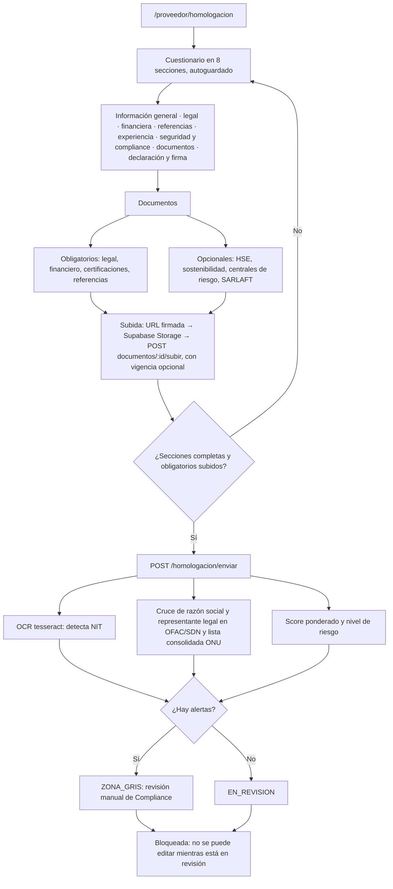
```mermaid
flowchart TD
    A["/proveedor/homologacion"] --> B["Cuestionario en 8 secciones, autoguardado"]
    B --> B1["Información general · legal · financiera · referencias · experiencia · seguridad y compliance · documentos · declaración y firma"]
    B1 --> C["Documentos"]
    C --> C1["Obligatorios: legal, financiero, certificaciones, referencias"]
    C --> C2["Opcionales: HSE, sostenibilidad, centrales de riesgo, SARLAFT"]
    C1 & C2 --> D["Subida: URL firmada → Supabase Storage → POST documentos/:id/subir, con vigencia opcional"]
    D --> E{"¿Secciones completas y obligatorios subidos?"}
    E -->|"No"| B
    E -->|"Sí"| F["POST /homologacion/enviar"]
    F --> G["OCR tesseract: detecta NIT"]
    F --> H["Cruce de razón social y representante legal en OFAC/SDN y lista consolidada ONU"]
    F --> I["Score ponderado y nivel de riesgo"]
    G & H & I --> J{"¿Hay alertas?"}
    J -->|"Sí"| K["ZONA_GRIS: revisión manual de Compliance"]
    J -->|"No"| L["EN_REVISION"]
    K & L --> M["Bloqueada: no se puede editar mientras está en revisión"]
```

### 4.2 Del lado de Compliance

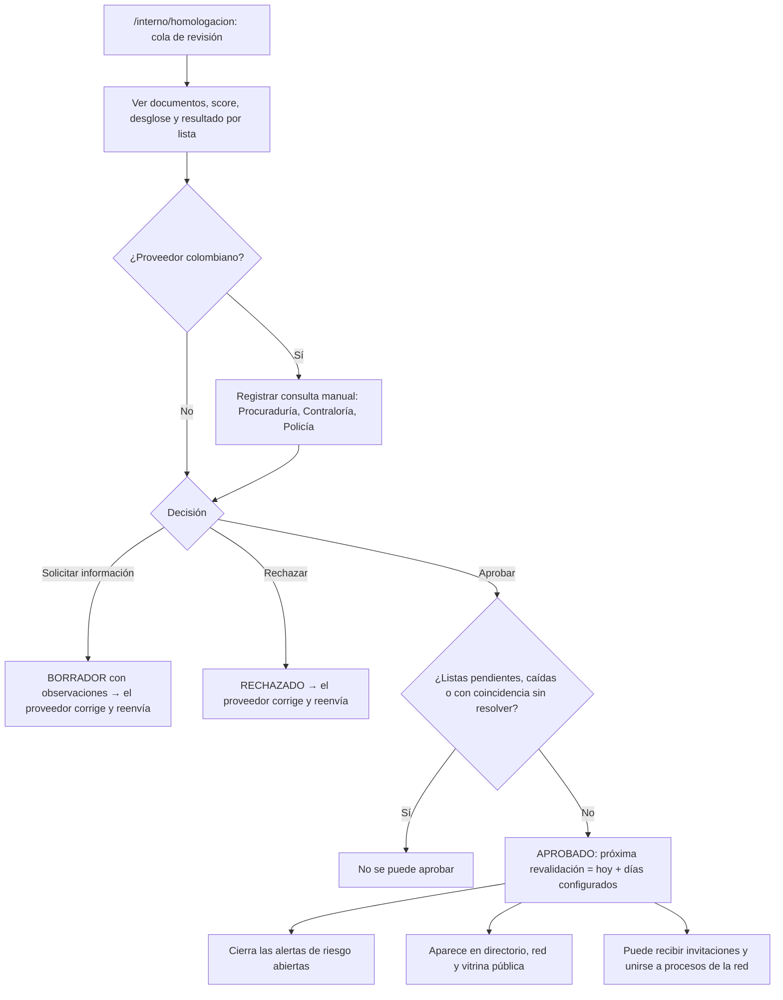
```mermaid
flowchart TD
    A["/interno/homologacion: cola de revisión"] --> B["Ver documentos, score, desglose y resultado por lista"]
    B --> C{"¿Proveedor colombiano?"}
    C -->|"Sí"| D["Registrar consulta manual: Procuraduría, Contraloría, Policía"]
    C -->|"No"| E
    D --> E{"Decisión"}
    E -->|"Solicitar información"| F["BORRADOR con observaciones → el proveedor corrige y reenvía"]
    E -->|"Rechazar"| G["RECHAZADO → el proveedor corrige y reenvía"]
    E -->|"Aprobar"| H{"¿Listas pendientes, caídas o con coincidencia sin resolver?"}
    H -->|"Sí"| H1["No se puede aprobar"]
    H -->|"No"| I["APROBADO: próxima revalidación = hoy + días configurados"]
    I --> J["Cierra las alertas de riesgo abiertas"]
    I --> K["Aparece en directorio, red y vitrina pública"]
    I --> L["Puede recibir invitaciones y unirse a procesos de la red"]
```

### 4.3 Estados

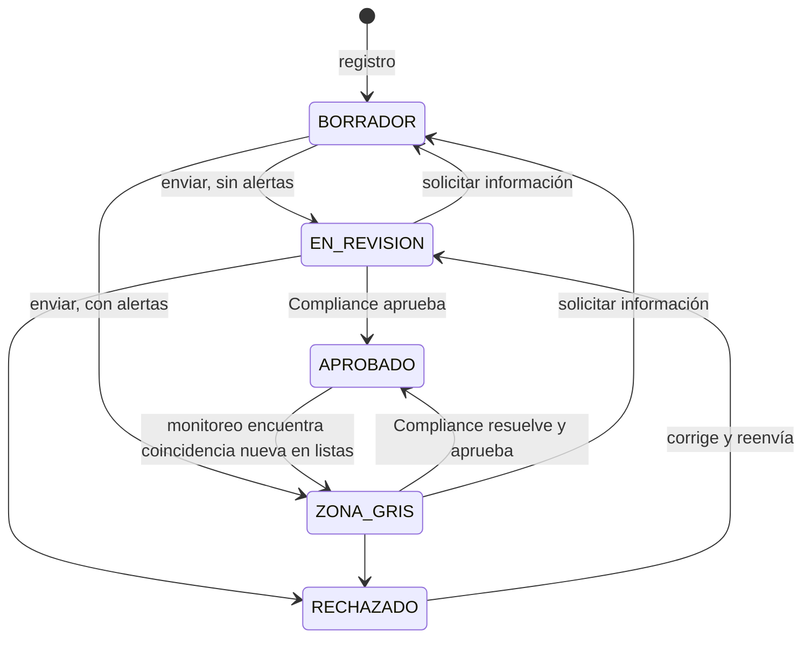
```mermaid
stateDiagram-v2
    [*] --> BORRADOR: registro
    BORRADOR --> EN_REVISION: enviar, sin alertas
    BORRADOR --> ZONA_GRIS: enviar, con alertas
    EN_REVISION --> APROBADO: Compliance aprueba
    ZONA_GRIS --> APROBADO: Compliance resuelve y aprueba
    EN_REVISION --> RECHAZADO
    ZONA_GRIS --> RECHAZADO
    EN_REVISION --> BORRADOR: solicitar información
    ZONA_GRIS --> BORRADOR: solicitar información
    RECHAZADO --> EN_REVISION: corrige y reenvía
    APROBADO --> ZONA_GRIS: monitoreo encuentra coincidencia nueva en listas
```

**Documentos de un proveedor ya aprobado**

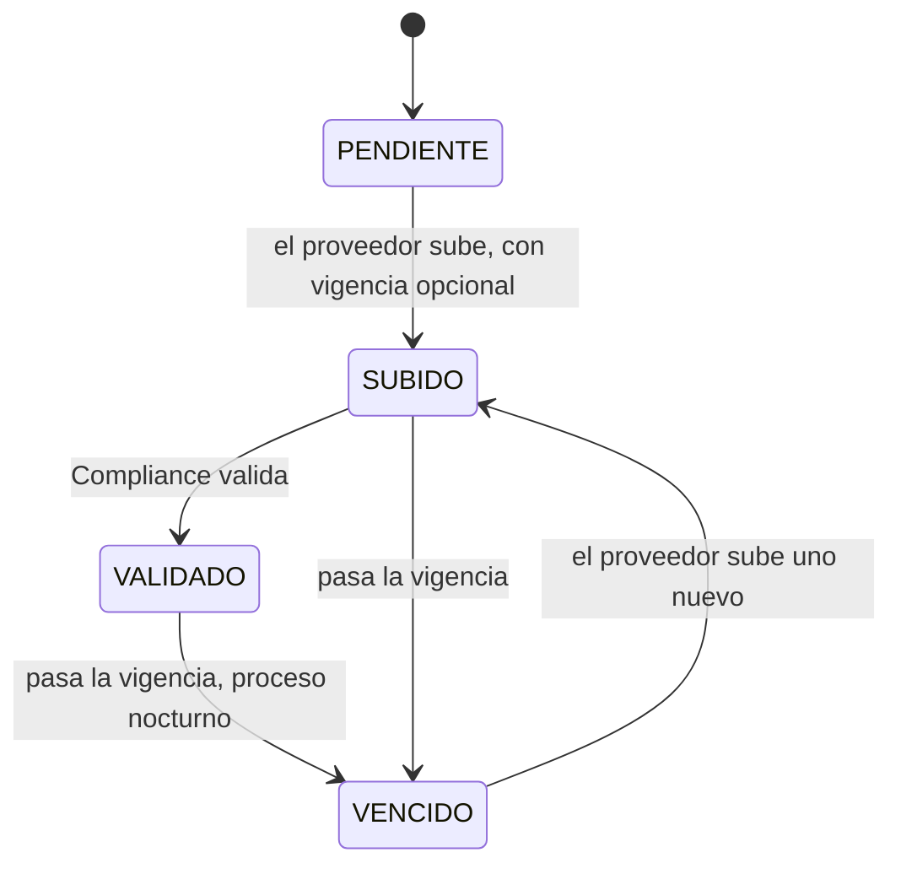
```mermaid
stateDiagram-v2
    [*] --> PENDIENTE
    PENDIENTE --> SUBIDO: el proveedor sube, con vigencia opcional
    SUBIDO --> VALIDADO: Compliance valida
    VALIDADO --> VENCIDO: pasa la vigencia, proceso nocturno
    SUBIDO --> VENCIDO: pasa la vigencia
    VENCIDO --> SUBIDO: el proveedor sube uno nuevo
```

Aprobado, el proveedor solo puede renovar documentos vencidos o agregar opcionales nunca subidos. Cada uno lo valida Compliance sin reabrir toda la homologación.

---

## 5. Creación del requerimiento

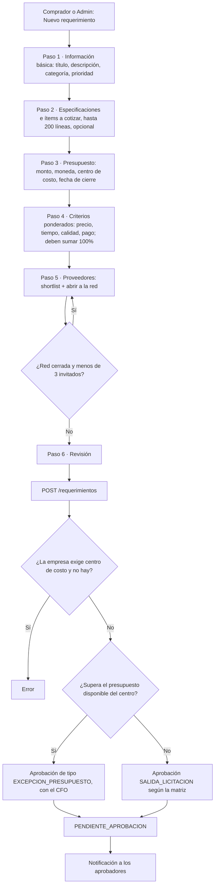
```mermaid
flowchart TD
    A["Comprador o Admin: Nuevo requerimiento"] --> P1["Paso 1 · Información básica: título, descripción, categoría, prioridad"]
    P1 --> P2["Paso 2 · Especificaciones e ítems a cotizar, hasta 200 líneas, opcional"]
    P2 --> P3["Paso 3 · Presupuesto: monto, moneda, centro de costo, fecha de cierre"]
    P3 --> P4["Paso 4 · Criterios ponderados: precio, tiempo, calidad, pago; deben sumar 100%"]
    P4 --> P5["Paso 5 · Proveedores: shortlist + abrir a la red"]
    P5 --> V{"¿Red cerrada y menos de 3 invitados?"}
    V -->|"Sí"| P5
    V -->|"No"| P6["Paso 6 · Revisión"]
    P6 --> S["POST /requerimientos"]
    S --> S1{"¿La empresa exige centro de costo y no hay?"}
    S1 -->|"Sí"| E1["Error"]
    S1 -->|"No"| S2{"¿Supera el presupuesto disponible del centro?"}
    S2 -->|"Sí"| S3["Aprobación de tipo EXCEPCION_PRESUPUESTO, con el CFO"]
    S2 -->|"No"| S4["Aprobación SALIDA_LICITACION según la matriz"]
    S3 & S4 --> T["PENDIENTE_APROBACION"]
    T --> U["Notificación a los aprobadores"]
```

Solo al aprobarse se envían las invitaciones y se publica en la red, nunca antes.

---

## 6. Aprobaciones y matriz

La **matriz de aprobación** de cada empresa decide, por rango de monto, qué rol aprueba y si es un aprobador único o una cadena secuencial.

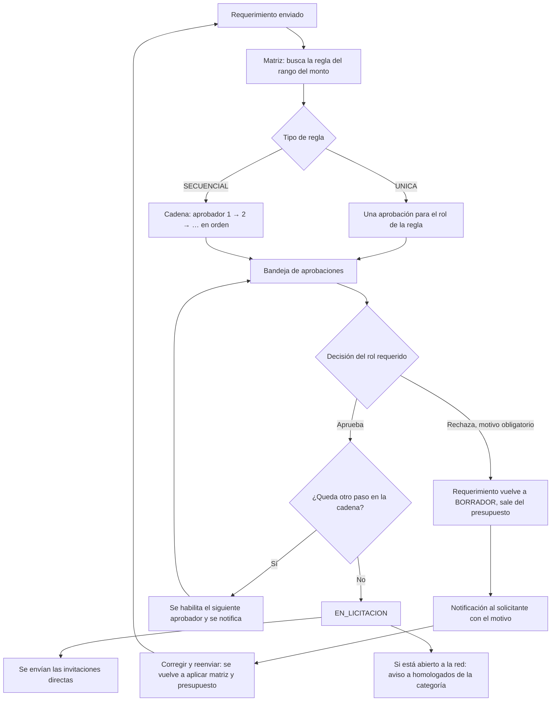
```mermaid
flowchart TD
    A["Requerimiento enviado"] --> B["Matriz: busca la regla del rango del monto"]
    B --> C{"Tipo de regla"}
    C -->|"UNICA"| D["Una aprobación para el rol de la regla"]
    C -->|"SECUENCIAL"| E["Cadena: aprobador 1 → 2 → … en orden"]
    D & E --> F["Bandeja de aprobaciones"]
    F --> G{"Decisión del rol requerido"}
    G -->|"Rechaza, motivo obligatorio"| H["Requerimiento vuelve a BORRADOR, sale del presupuesto"]
    H --> H1["Notificación al solicitante con el motivo"]
    H1 --> H2["Corregir y reenviar: se vuelve a aplicar matriz y presupuesto"] --> A
    G -->|"Aprueba"| I{"¿Queda otro paso en la cadena?"}
    I -->|"Sí"| J["Se habilita el siguiente aprobador y se notifica"] --> F
    I -->|"No"| K["EN_LICITACION"]
    K --> K1["Se envían las invitaciones directas"]
    K --> K2["Si está abierto a la red: aviso a homologados de la categoría"]
```

Otro rol, o alguien que no es el siguiente de la cadena, recibe un error: "Esta aprobación ya fue resuelta" o "no te corresponde".

---

## 7. Licitación: invitaciones, red, preguntas y ofertas

Del lado del cliente, la licitación, el comparativo, la negociación y la adjudicación son pestañas de una misma ficha: `/cliente/procesos/:id`. Del lado del proveedor, todo está en `/proveedor/procesos`, con las pestañas Nuevos, Participando y Terminados.

### 7.1 Cómo llegan los proveedores

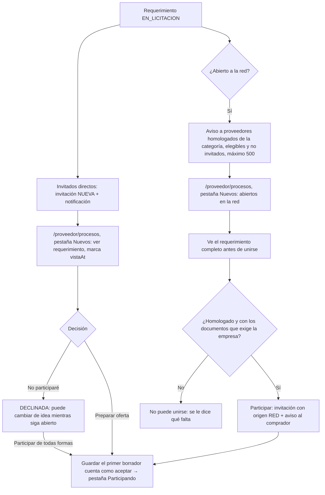
```mermaid
flowchart TD
    A["Requerimiento EN_LICITACION"] --> B["Invitados directos: invitación NUEVA + notificación"]
    A --> C{"¿Abierto a la red?"}
    C -->|"Sí"| D["Aviso a proveedores homologados de la categoría, elegibles y no invitados, máximo 500"]
    D --> E["/proveedor/procesos, pestaña Nuevos: abiertos en la red"]
    E --> F["Ve el requerimiento completo antes de unirse"]
    F --> G{"¿Homologado y con los documentos que exige la empresa?"}
    G -->|"No"| G1["No puede unirse: se le dice qué falta"]
    G -->|"Sí"| H["Participar: invitación con origen RED + aviso al comprador"]
    B --> I["/proveedor/procesos, pestaña Nuevos: ver requerimiento, marca vistaAt"]
    I --> J{"Decisión"}
    J -->|"No participaré"| K["DECLINADA: puede cambiar de idea mientras siga abierto"]
    J -->|"Preparar oferta"| L["Guardar el primer borrador cuenta como aceptar → pestaña Participando"]
    K -->|"Participar de todas formas"| L
    H --> L
```

### 7.2 Oferta, preguntas y tablero en vivo

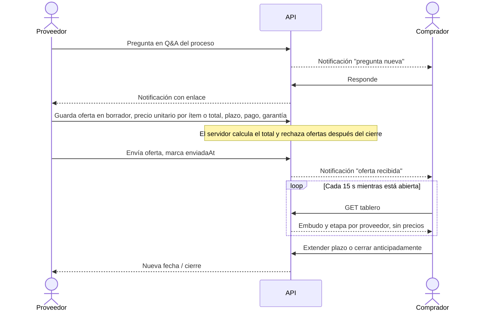
```mermaid
sequenceDiagram
    actor P as Proveedor
    participant API as API
    actor C as Comprador
    P->>API: Pregunta en Q&A del proceso
    API-->>C: Notificación "pregunta nueva"
    C->>API: Responde
    API-->>P: Notificación con enlace
    P->>API: Guarda oferta en borrador, precio unitario por ítem o total, plazo, pago, garantía
    Note over API: El servidor calcula el total y rechaza ofertas después del cierre
    P->>API: Envía oferta, marca enviadaAt
    API-->>C: Notificación "oferta recibida"
    loop Cada 15 s mientras está abierta
        C->>API: GET tablero
        API-->>C: Embudo y etapa por proveedor, sin precios
    end
    C->>API: Extender plazo o cerrar anticipadamente
    API-->>P: Nueva fecha / cierre
```

**Etapas del tablero en vivo**

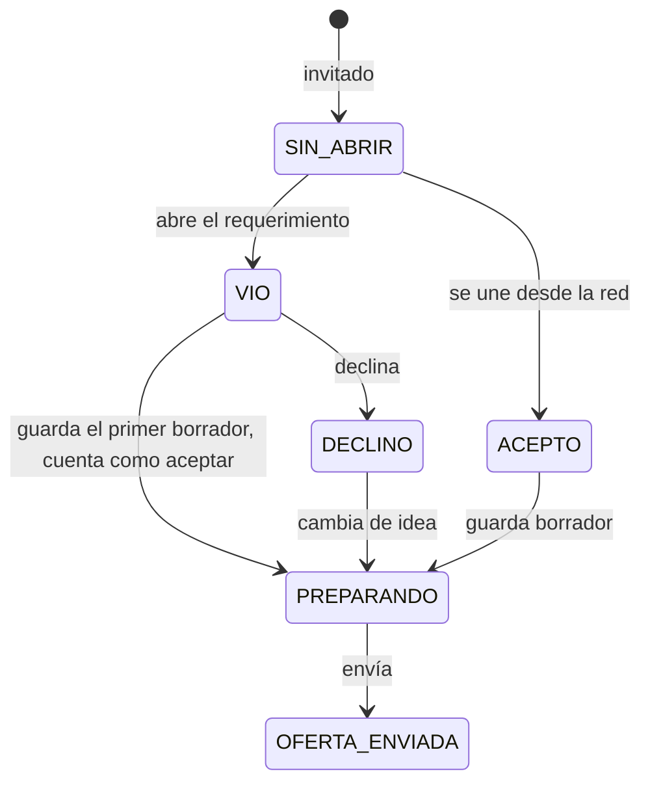
```mermaid
stateDiagram-v2
    [*] --> SIN_ABRIR: invitado
    SIN_ABRIR --> VIO: abre el requerimiento
    VIO --> PREPARANDO: guarda el primer borrador, cuenta como aceptar
    VIO --> DECLINO: declina
    ACEPTO --> PREPARANDO: guarda borrador
    DECLINO --> PREPARANDO: cambia de idea
    PREPARANDO --> OFERTA_ENVIADA: envía
    SIN_ABRIR --> ACEPTO: se une desde la red
```

---

## 8. Evaluación y decisión

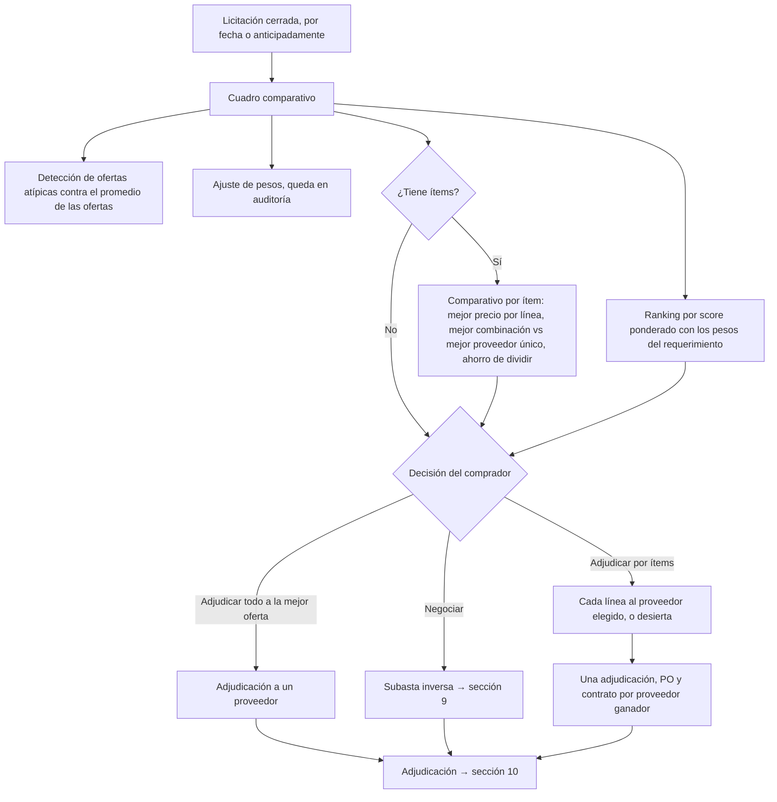
```mermaid
flowchart TD
    A["Licitación cerrada, por fecha o anticipadamente"] --> B["Cuadro comparativo"]
    B --> B1["Ranking por score ponderado con los pesos del requerimiento"]
    B --> B2["Detección de ofertas atípicas contra el promedio de las ofertas"]
    B --> B3["Ajuste de pesos, queda en auditoría"]
    B --> B4{"¿Tiene ítems?"}
    B4 -->|"Sí"| B5["Comparativo por ítem: mejor precio por línea, mejor combinación vs mejor proveedor único, ahorro de dividir"]
    B4 -->|"No"| C
    B5 --> C{"Decisión del comprador"}
    B1 --> C
    C -->|"Adjudicar todo a la mejor oferta"| D["Adjudicación a un proveedor"]
    C -->|"Adjudicar por ítems"| E["Cada línea al proveedor elegido, o desierta"]
    C -->|"Negociar"| F["Subasta inversa → sección 9"]
    E --> G["Una adjudicación, PO y contrato por proveedor ganador"]
    D & F & G --> H["Adjudicación → sección 10"]
```

Una oferta que no cotizó todas las líneas se marca "cotizó N de M ítems". Para el ranking, cada línea faltante cuenta al precio más alto de esa línea.

---

## 9. Negociación: subasta inversa en vivo

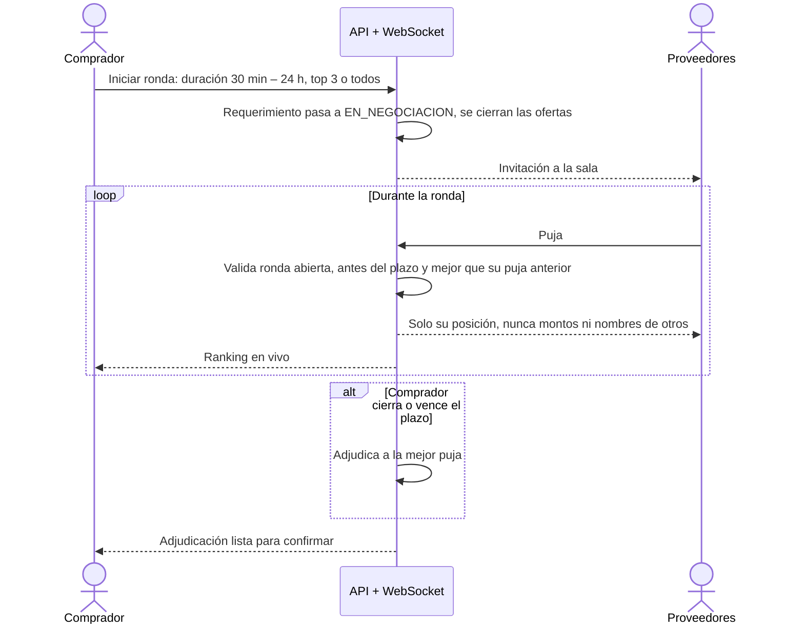
```mermaid
sequenceDiagram
    actor C as Comprador
    participant API as API + WebSocket
    actor P as Proveedores
    C->>API: Iniciar ronda: duración 30 min – 24 h, top 3 o todos
    API->>API: Requerimiento pasa a EN_NEGOCIACION, se cierran las ofertas
    API-->>P: Invitación a la sala
    loop Durante la ronda
        P->>API: Puja
        API->>API: Valida ronda abierta, antes del plazo y mejor que su puja anterior
        API-->>P: Solo su posición, nunca montos ni nombres de otros
        API-->>C: Ranking en vivo
    end
    alt Comprador cierra o vence el plazo
        API->>API: Adjudica a la mejor puja
    end
    API-->>C: Adjudicación lista para confirmar
```

Con ítems, las líneas del ganador se escalan en la proporción puja / oferta.

---

## 10. Adjudicación y firma

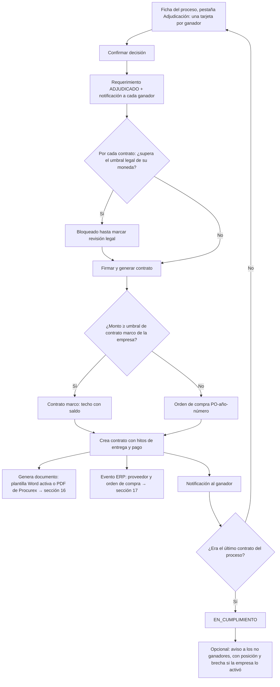
```mermaid
flowchart TD
    A["Ficha del proceso, pestaña Adjudicación: una tarjeta por ganador"] --> B["Confirmar decisión"]
    B --> C["Requerimiento ADJUDICADO + notificación a cada ganador"]
    C --> D{"Por cada contrato: ¿supera el umbral legal de su moneda?"}
    D -->|"Sí"| E["Bloqueado hasta marcar revisión legal"] --> F
    D -->|"No"| F["Firmar y generar contrato"]
    F --> G{"¿Monto ≥ umbral de contrato marco de la empresa?"}
    G -->|"Sí"| H["Contrato marco: techo con saldo"]
    G -->|"No"| I["Orden de compra PO-año-número"]
    H & I --> J["Crea contrato con hitos de entrega y pago"]
    J --> K["Genera documento: plantilla Word activa o PDF de Procurex → sección 16"]
    J --> L["Evento ERP: proveedor y orden de compra → sección 17"]
    J --> M["Notificación al ganador"]
    M --> N{"¿Era el último contrato del proceso?"}
    N -->|"No"| A
    N -->|"Sí"| O["EN_CUMPLIMIENTO"]
    O --> P["Opcional: aviso a los no ganadores, con posición y brecha si la empresa lo activó"]
```

No se puede firmar dos veces, y un ítem no se adjudica dos veces.

---

## 11. Contratos, contrato marco y modificaciones

### 11.1 Contrato marco y órdenes de compra

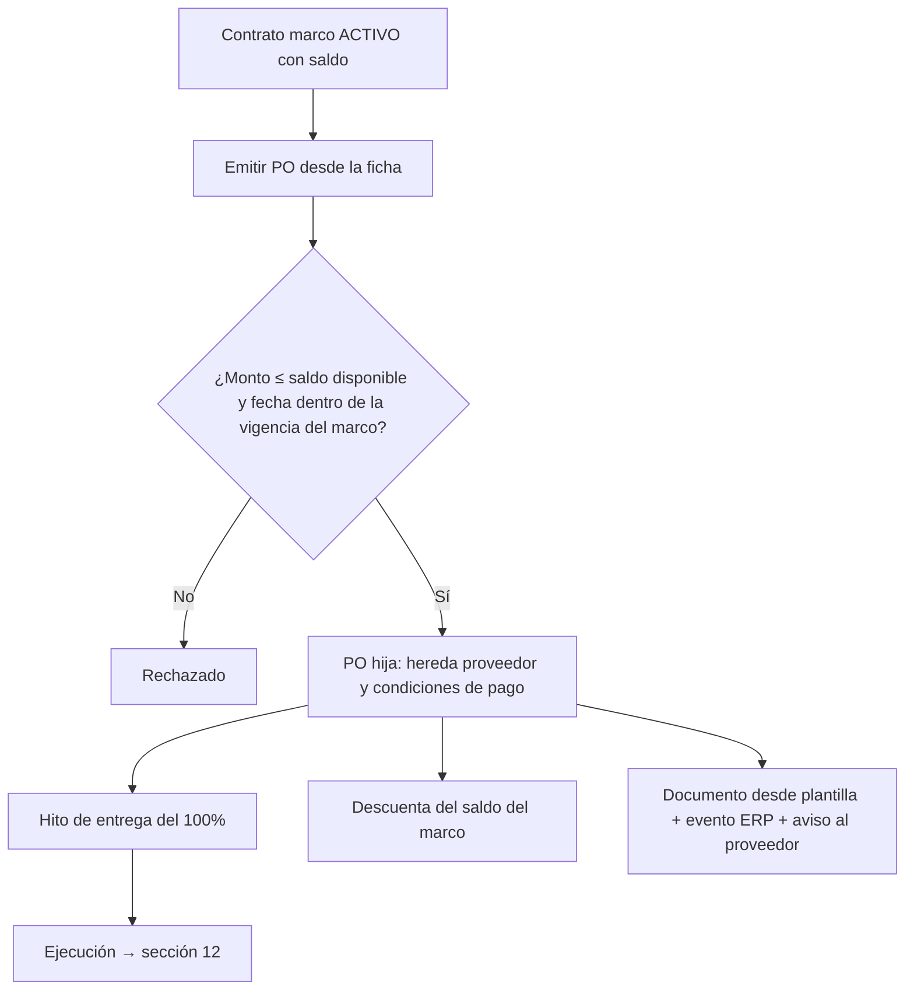
```mermaid
flowchart TD
    A["Contrato marco ACTIVO con saldo"] --> B["Emitir PO desde la ficha"]
    B --> C{"¿Monto ≤ saldo disponible y fecha dentro de la vigencia del marco?"}
    C -->|"No"| C1["Rechazado"]
    C -->|"Sí"| D["PO hija: hereda proveedor y condiciones de pago"]
    D --> E["Hito de entrega del 100%"]
    D --> F["Descuenta del saldo del marco"]
    D --> G["Documento desde plantilla + evento ERP + aviso al proveedor"]
    E --> H["Ejecución → sección 12"]
```

### 11.2 Modificaciones

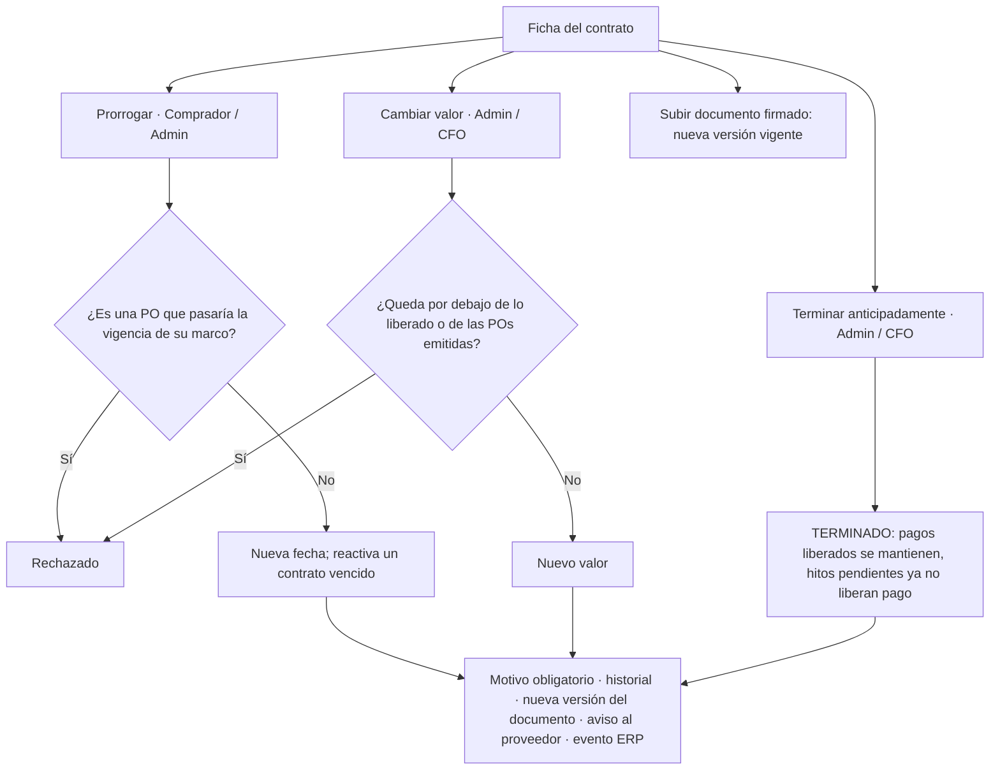
```mermaid
flowchart TD
    A["Ficha del contrato"] --> B["Prorrogar · Comprador / Admin"]
    A --> C["Cambiar valor · Admin / CFO"]
    A --> D["Terminar anticipadamente · Admin / CFO"]
    A --> E["Subir documento firmado: nueva versión vigente"]
    B --> B1{"¿Es una PO que pasaría la vigencia de su marco?"}
    B1 -->|"Sí"| X["Rechazado"]
    B1 -->|"No"| B2["Nueva fecha; reactiva un contrato vencido"]
    C --> C1{"¿Queda por debajo de lo liberado o de las POs emitidas?"}
    C1 -->|"Sí"| X
    C1 -->|"No"| C2["Nuevo valor"]
    D --> D1["TERMINADO: pagos liberados se mantienen, hitos pendientes ya no liberan pago"]
    B2 & C2 & D1 --> F["Motivo obligatorio · historial · nueva versión del documento · aviso al proveedor · evento ERP"]
```

### 11.3 Estados del contrato

```mermaid
stateDiagram-v2
    [*] --> ACTIVO: firma
    ACTIVO --> POR_VENCER: faltan 30 días o menos, proceso diario
    POR_VENCER --> VENCIDO: pasa la fecha fin
    ACTIVO --> VENCIDO: pasa la fecha fin
    POR_VENCER --> ACTIVO: prórroga
    VENCIDO --> ACTIVO: prórroga
    ACTIVO --> TERMINADO: terminación anticipada
    POR_VENCER --> TERMINADO
    VENCIDO --> TERMINADO
```

Hay avisos a compradores y administradores a 60, 30 y 15 días del fin.

---

## 12. Ejecución: hitos y entregas

```mermaid
flowchart TD
    A["Contrato con hitos: % del valor y fecha"] --> B["Proveedor: reporta avance en su ficha"]
    B --> C["Notificación al comprador"]
    C --> D["Contratos, vista Entregas: En ejecución · Con atrasos · Todos"]
    D --> E{"Comprador: marcar como recibido, con confirmación"}
    E --> F["Hito COMPLETADO: no se reabre ni cambia su %"]
    F --> G["Se libera el pago del hito → sección 13"]
    F --> H["Evento ERP: recepción"]
    D --> J["Evaluar al proveedor → sección 14"]
    A --> K["Proceso diario"]
    K --> K1["3 días antes de la fecha: EN_RIESGO"]
    K --> K2["Pasada la fecha: ATRASADO"]
    K2 --> K3["Penalidad estimada, si la empresa la configuró"]
```

```mermaid
stateDiagram-v2
    [*] --> PENDIENTE
    PENDIENTE --> EN_RIESGO: faltan 3 días
    EN_RIESGO --> ATRASADO: pasó la fecha
    PENDIENTE --> ATRASADO
    PENDIENTE --> COMPLETADO: recibido
    EN_RIESGO --> COMPLETADO: recibido
    ATRASADO --> COMPLETADO: recibido
```

Los % de pago de un contrato no pueden sumar más de 100%.

---

## 13. Facturación, pagos y pronto pago

```mermaid
sequenceDiagram
    actor P as Proveedor
    participant API as API
    actor C as Comprador / Admin / CFO
    participant ERP as ERP / Siigo
    Note over API: Hito recibido → pago PENDIENTE
    P->>API: Radica factura: número, fecha, PDF/XML/imagen
    API-->>C: Factura por revisar
    alt Rechaza con motivo
        C->>API: Rechazar
        API-->>P: Motivo → radica otra, queda el historial
    else Aprueba
        C->>API: Aprobar
        API->>ERP: Factura aprobada
        Note over API: El plazo de pago cuenta desde la radicación
    end
    opt Pronto pago
        P->>API: Solicita fecha anticipada, 1,5% por cada 30 días
        C->>API: Admin / CFO acepta o rechaza
        API-->>P: Nueva fecha y descuento
    end
    C->>API: Admin / CFO registra el pago: fecha, referencia, soporte
    API->>ERP: Pago
    API-->>P: Pagado: fecha, monto neto, referencia
```

```mermaid
stateDiagram-v2
    state "Pago" as PAGO {
        [*] --> PENDIENTE: hito recibido
        PENDIENTE --> VENCIDO: pasa la fecha pactada
        PENDIENTE --> PAGADO: se registra el pago
        VENCIDO --> PAGADO
    }
    state "Factura" as FAC {
        [*] --> RADICADA
        RADICADA --> APROBADA
        RADICADA --> RECHAZADA
        RECHAZADA --> [*]: el proveedor radica otra
    }
```

Un pago solo se registra con la factura aprobada, y nunca dos veces. Si la empresa paga desde Siigo, Procurex lee las facturas saldadas cada 10 minutos y las marca pagadas. Un ERP también puede informar pagos por la API de entrada.

---

## 14. Evaluación de desempeño

La relación con el proveedor la maneja cada empresa directamente. Procurex no media en los procesos de compra.

```mermaid
flowchart TD
    H["Contrato en ejecución o cumplido"] --> I["Evaluar: calidad, plazos, servicio y HSE de 1 a 5"]
    I --> J["Promedio del proveedor en directorio y vitrina"]
    I --> K{"¿Bajo 60/100?"}
    K -->|"Sí"| L["Aviso de plan de mejora al proveedor"]
```

---

## 15. Cierre del proceso: ciclo de vida del requerimiento

```mermaid
stateDiagram-v2
    [*] --> BORRADOR
    BORRADOR --> PENDIENTE_APROBACION: enviar
    PENDIENTE_APROBACION --> BORRADOR: rechazo
    PENDIENTE_APROBACION --> EN_LICITACION: última aprobación
    EN_LICITACION --> EN_NEGOCIACION: iniciar subasta
    EN_LICITACION --> ADJUDICADO: confirmar adjudicación
    EN_NEGOCIACION --> ADJUDICADO: cierre de la ronda
    ADJUDICADO --> EN_CUMPLIMIENTO: último contrato firmado
    EN_CUMPLIMIENTO --> CERRADO: todos los contratos cumplidos o terminados y sin marco vigente
    CERRADO --> [*]
```

---

## 16. Plantillas y documentos

```mermaid
flowchart TD
    A["Admin: Plantillas y documentos"] --> B["Subir .docx con marcadores"]
    B --> C{"Validación"}
    C -->|"Marcadores mal escritos o llaves sin cerrar"| D["Rechazada con el error exacto"]
    C -->|"OK"| E["Advertencias: falta NIT o valor"]
    E --> F["Vista previa con el último contrato real, en PDF o Word"]
    F --> G["Activar: una activa por tipo, orden de compra o contrato marco; la de categoría gana a la general"]
    A --> H["Marca y datos: razón social, NIT, logo, color, cláusulas, pie, penalidad opcional"]

    I["Firma de adjudicación o emisión de PO"] --> J{"¿Plantilla activa?"}
    J -->|"Sí"| K["Llena la plantilla → Gotenberg / LibreOffice → PDF"]
    J -->|"No"| L["PDF de Procurex con la marca de la empresa"]
    K & L --> M["Documento vigente del contrato"]
    N["Prórroga o cambio de valor"] --> O["Nueva versión"] --> M
    K -.->|"Si falla"| P["La firma no se bloquea; error en auditoría"]
    M --> Q["El proveedor descarga la versión vigente"]
```

---

## 17. Integración ERP y Siigo

```mermaid
flowchart TD
    A["Evento de negocio: proveedor, orden de compra, recepción, factura aprobada, pago"] --> B["Outbox: evento PENDIENTE con foto completa y versión"]
    B --> C{"Modo de la empresa"}
    C -->|"ARCHIVO"| D["Cola de pendientes → descarga Excel / CSV → marcado como exportado"]
    C -->|"WEBHOOK"| E["Worker cada 30 s: POST firmado HMAC-SHA256 con timestamp"]
    E --> E1{"¿2xx?"}
    E1 -->|"Sí"| E2["ENVIADO"]
    E1 -->|"No"| E3["ERROR: reintento de 1 min a 24 h"] --> E4["FALLIDO tras agotar reintentos"]
    C -->|"SIIGO"| F["Conector nativo"]
    F --> F1["Proveedor → tercero con NIT y dígito de verificación"]
    F --> F2["Factura aprobada → factura de compra con cuenta, centro de costo e IVA"]
    F --> F3["Pago → comprobante de egreso"]
    F --> F4["Cada 10 min: facturas saldadas en Siigo → pagadas en Procurex"]
    G["Mapeos: centro de costo → código ERP, categoría → cuenta contable"] --> E & F
    H["API de entrada con API key"] --> H1["ERP informa pagos, sin duplicar"]
    H --> H2["Acuse: número interno del ERP"]
    E2 & E4 & F1 & F2 & F3 --> I["Panel de sincronización: reintentar o descartar"]
```

---

## 18. Riesgo continuo

Proceso nocturno a las 04:15, con lock en Redis. Compliance también puede ejecutarlo desde `/interno/riesgo`.

```mermaid
flowchart TD
    A["Monitoreo diario"] --> B["Documentos con vigencia de proveedores aprobados"]
    A --> C["Listas restrictivas: lotes de 50 aprobados sin revisar en 30 días"]
    A --> D["Revalidaciones vencidas"]
    B --> B1{"Días para vencer"}
    B1 -->|"30, 15 o 7"| B2["Aviso al proveedor, una vez por umbral"]
    B1 -->|"0 o menos"| B3["Documento VENCIDO + alerta + aviso al proveedor"]
    C --> C1["Re-consulta OFAC y ONU"]
    C1 --> C2{"Resultado"}
    C2 -->|"Alguna lista no responde"| C3["No se da por limpio: reintenta mañana"]
    C2 -->|"Sin coincidencias"| C4["Guarda verificación y fecha de monitoreo"]
    C2 -->|"Coincidencia nueva"| C5["Homologación → ZONA_GRIS"]
    C5 --> C6["Alerta LISTA_RESTRICTIVA + auditoría + aviso a Compliance"]
    C5 --> C7["Empresas con contratos vigentes: aviso 'en revisión' sin detalle"]
    C5 --> C8["Al proveedor no se le revela"]
    D --> D1["Alerta REVALIDACION + aviso al proveedor"]
    B3 & C6 & D1 --> E["/interno/riesgo: resolver con nota"]
    F["Re-aprobar homologación o validar el documento"] --> G["Cierra las alertas solas"]
    H["Comprador: ficha del proveedor"] --> H1["Último monitoreo y alertas abiertas; listas como 'en revisión'"]
```

---

## 19. Red de proveedores y vitrina

```mermaid
flowchart TD
    A["Proveedor se registra gratis"] --> B["Se homologa una vez"]
    B --> C["Aparece en /red y en el directorio de clientes"]
    B --> D["Vitrina pública /vitrina/:id: presentación, video, galería, brochures, catálogo, métricas verificadas"]
    C --> E["Compradores lo encuentran e invitan"]
    F["Cada nueva empresa cliente abre procesos a la red"] --> G["Aviso a homologados de la categoría"]
    G --> H["Procesos › Nuevos: se une sin invitación"]
    H --> I["Más ofertas por proceso para el cliente"]
    I --> F
    D --> J["Cuenta visitas, las ve el proveedor"]
```

---

## 20. Analítica

```mermaid
flowchart TD
    A["Analítica CFO · CFO y Admin"] --> A1["Filtros: período, unidad, centro de costo, categoría"]
    A1 --> A2["GET /analitica/cfo: filas de procesos, contratos y pagos"]
    A2 --> A3["Un único cálculo en el navegador"]
    A3 --> A4["Resumen: 8 indicadores vs período anterior + hallazgos"]
    A3 --> A5["Pestañas: gasto, ahorro, eficiencia, proveedores, presupuesto, pagos, detalle"]
    A3 --> A6["Mis gráficas: 10 indicadores × 8 dimensiones, guardadas por usuario"]
    A4 & A5 & A6 --> A7["Exportar: PDF ejecutivo, Excel multi-hoja, CSV por tabla"]

    B["Mi desempeño · Proveedor"] --> B1["Solo sus datos: adjudicado, tasa de éxito y respuesta, ventas, cumplimiento, cobros, visitas"]
    B1 --> B2{"¿El cliente activó la retroalimentación?"}
    B2 -->|"Sí"| B3["Posición por precio y brecha en procesos perdidos, sin nombres ni precios ajenos"]
    B2 -->|"No"| B4["Solo ganó o perdió"]
    B1 --> B5["Exportar PDF, Excel, CSV"]
```

---

## 21. Panel interno

Procurex no participa en los procesos de compra de ninguna empresa. El panel interno sirve para ver cómo va cada empresa con cifras agregadas, dar de alta empresas nuevas y homologar proveedores.

```mermaid
flowchart TD
    A["Login interno"] --> B["Empresas: lista con plan, facturación, configuración, usuarios, procesos en curso, contratos vigentes y último acceso"]
    B --> C["Ficha de la empresa, solo lectura"]
    C --> C1["Pasos de configuración y uso del plan"]
    C --> C2["Actividad agregada: procesos por etapa, contratos, pagos, monto contratado, 6 meses"]
    C --> C3["Equipo y último acceso"]
    C2 -.-> X["Sin títulos, ofertas, precios ni proveedores elegidos"]
    A --> D{"¿Compliance / Ops?"}
    D -->|"Sí"| E["Nueva empresa → sección 2"]
    D -->|"Sí"| F["Cola de homologación → sección 4.2"]
    D -->|"Sí"| G["Riesgo continuo → sección 18"]
    D -->|"No, consultor"| B
```

---

## 22. Procesos automáticos y notificaciones

```mermaid
flowchart TD
    subgraph CRON["Procesos programados"]
        V["06:00 Vencimientos: contratos por vencer y vencidos, hitos en riesgo y atrasados, pagos vencidos"]
        R["04:15 Riesgo continuo: listas, documentos, revalidación"]
        AU["03:00 Retención de auditoría"]
        W["Cada 30 s: envío de eventos ERP"]
        S["Cada 10 min: pagos desde Siigo"]
    end
    subgraph EVT["Eventos que notifican"]
        N1["Aprobación pendiente o resuelta"]
        N2["Invitación, convocatoria de la red, pregunta, respuesta"]
        N3["Oferta recibida, proveedor se unió desde la red"]
        N4["Subasta iniciada, adjudicación, contrato firmado"]
        N5["Avance de hito, recepción, factura, pago, pronto pago"]
        N6["Modificaciones de contrato y vencimientos"]
        N7["Homologación resuelta, documentos por vencer, alertas de riesgo"]
    end
    CRON --> NT["Centro de notificaciones: cada una lleva a su pantalla"]
    EVT --> NT
    NT --> M["Correo, según las preferencias de cada usuario"]
    EVT --> AUD["Bitácora de auditoría, exportable en CSV"]
```

---

## 23. Resumen de estados

| Entidad | Estados |
|---|---|
| Requerimiento | BORRADOR → PENDIENTE_APROBACION → EN_LICITACION → EN_NEGOCIACION → ADJUDICADO → EN_CUMPLIMIENTO → CERRADO |
| Aprobación | PENDIENTE · APROBADA · RECHAZADA (tipos: salida a licitación, adjudicación, excepción de presupuesto) |
| Homologación | BORRADOR · EN_REVISION · ZONA_GRIS · APROBADO · RECHAZADO |
| Documento de homologación | PENDIENTE · SUBIDO · VALIDADO · VENCIDO |
| Invitación | NUEVA · VISTA · RESPONDIDA · DECLINADA · VENCIDA (origen: invitación o red) |
| Subasta | INACTIVA · ACTIVA · CERRADA |
| Contrato | ACTIVO · POR_VENCER · VENCIDO · EN_RENOVACION · TERMINADO (tipo: contrato, PO, adenda) |
| Hito | PENDIENTE · EN_RIESGO · ATRASADO · COMPLETADO |
| Pago | PENDIENTE · VENCIDO · PAGADO |
| Factura | RADICADA · APROBADA · RECHAZADA |
| Pronto pago | SOLICITADA · ACEPTADA · RECHAZADA |
| Evento ERP | PENDIENTE · ENVIADO · ERROR · FALLIDO · DESCARTADO |
| Alerta de riesgo | ABIERTA · RESUELTA (tipos: lista restrictiva, documento vencido, revalidación) |
